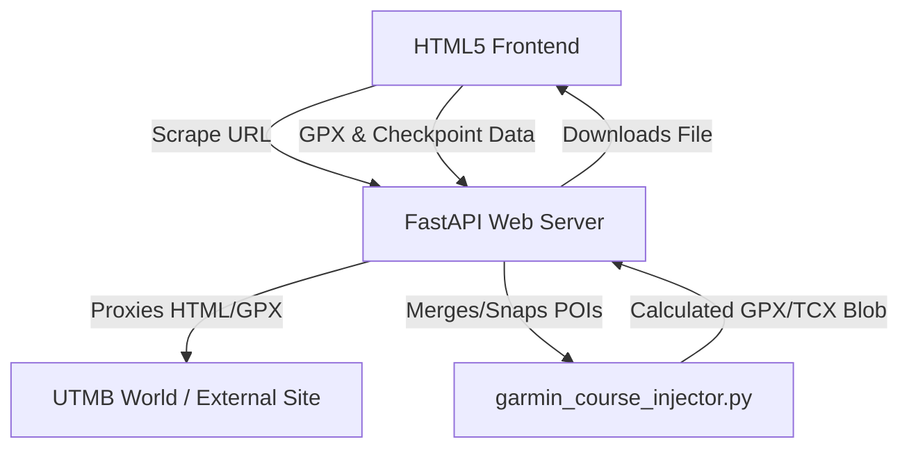

# 🏔️ Architecture Overview

This document describes the structure, components, and security posture of the **Trail Mapper & Garmin POI Merger** application.

---

## 🏗️ High-Level Component Layout

The application is split into three main layers:
1. **Frontend (ES6 Modules)**: An interactive single-page application built on vanilla HTML5/CSS3 and Leaflet, running in the user's browser.
2. **Backend Web API (FastAPI)**: Serves static assets, proxies external scraping requests safely, and routes track-generation tasks.
3. **Core Injection Engine (`garmin_course_injector.py`)**: An in-memory GPX/TCX calibration engine that performs mathematical snapping of checkpoint coordinates to track coordinates and handles timezone/timestamp calibration.

---

## 📂 Codebase Modules & Files

For details on the project structure, refer to the [README.md](README.md#📂-project-structure).

### 1. Frontend Sub-modules (`public/`)
Following modern web standards, the frontend uses native browser **ES Modules** (loaded via `<script type="module">` in [index.html](public/index.html)) to divide concerns without build tools:
* **[state.js](public/state.js)**: Holds the application's global reactive state (route data, checkpoints, and settings) and persists it locally via `localStorage`.
* **[translations.js](public/translations.js)**: Translates interface strings and Garmin waypoint symbols between French (`fr`) and English (`en`).
* **[map-utils.js](public/map-utils.js)**: Manages the Leaflet map, polyline route drawing, custom symbol icon mappings, and the spatial snapping calculator.
* **[elevation-chart.js](public/elevation-chart.js)**: Renders the altimetric profile using a high-density HTML5 `<canvas>`, providing cross-hair hover snapping synchronized with the Leaflet map.
* **[utils.js](public/utils.js)**: Implements Garmin-specific name-truncation rules and trail-abbreviations (e.g. converting *Ravitaillement* to `RAV`).
* **[app.js](public/app.js)**: Orchestrates the UI DOM selectors, triggers downloads, listens to drop zones, and fetches race data.

### 2. Backend API ([server.py](server.py))
* **SSRF Guard**: Resolves remote hostnames through `socket.getaddrinfo` to ensure target URLs are not loopbacks or local private IP addresses before sending HTTP requests.
* **Next.js Scraper**: Extracts the `__NEXT_DATA__` script block from UTMB pages to parse official race aid stations, categories, and GPX track endpoints.
* **In-Memory Merging**: Uploaded GPX XML structures and JSON checkpoint tables are fed into `garmin_course_injector.py` and output directly to the client without saving files to disk.

### 3. Waypoint Calibration Engine ([garmin_course_injector.py](garmin_course_injector.py))
* **Coordinate Projection**: Snaps each checkpoint to the nearest trackpoint coordinates on the GPX path.
* **Garmin Time Calibration**: Linearly interpolates timestamps between checkpoints to ensure monotonic time progression, preventing Garmin watches from discarding track segments.
* **TCX CoursePoint Sync**: Links each course point time to the corresponding track point time for ETA and distance-to-next device calculations.

---

## 🔒 Security Posture & Safeguards

The application implements several security controls to guarantee safe operations:
* **XML Entity Sanitization**: Defends against XML Bomb / XXE attacks by routing all XML parsing through `defusedxml.ElementTree`.
* **Safe SSRF Proxying**: Uses hostname-IP resolution validation to prevent attackers from querying backend services or localhost.
* **No Database/State Vulnerabilities**: Data is processed in-memory and discarded, eliminating injection or state-leakage attack vectors.

For a detailed analysis of risks and remediations (such as mitigating DNS Rebinding), see the **[Security Assessment Report](security_assessment.md)**.

---

## 🗺️ Developer Links & Next Steps
* Learn more about deployment guidelines in the [README.md](README.md#💻-local-development).
* Check out the development roadmap and pending tasks in the [TODO.md](TODO.md).
