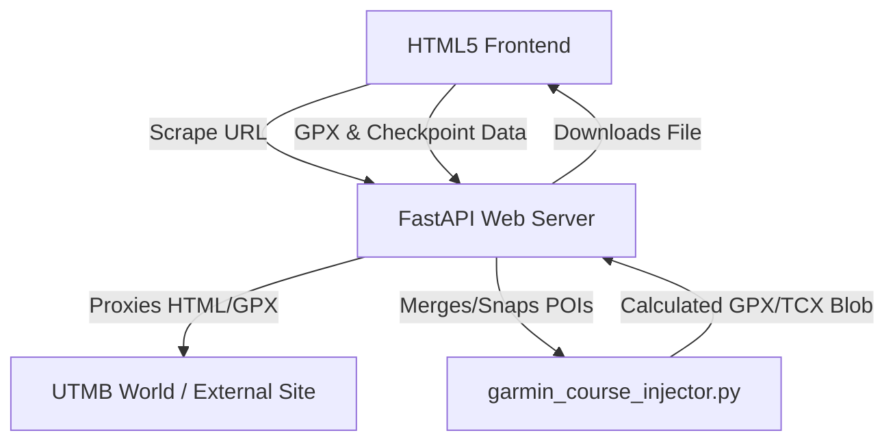

# 🏔️ Architecture Overview

This document describes the structure, components, and security posture of the **Trail Mapper & Garmin POI Merger** application.

---

## 🏗️ High-Level Component Layout

The application is split into three main layers:
1. **Frontend (ES6 Modules)**: An interactive single-page application built on vanilla HTML5/CSS3 and Leaflet, running in the user's browser.
2. **Backend Web API (FastAPI)**: Serves static assets, proxies external scraping requests safely, and routes track-generation tasks.
3. **Core Injection Engine (`garmin_course_injector.py`)**: An in-memory GPX/TCX calibration engine that performs mathematical snapping of checkpoint coordinates to track coordinates and handles timezone/timestamp calibration.

```mermaid
graph TD
    UI[HTML5 Frontend] -->|Scrape URL| API[FastAPI Web Server]
    UI -->|GPX & Checkpoint Data| API
    API -->|Proxies HTML/GPX| UTMB[UTMB World / External Site]
    API -->|Merges/Snaps POIs| Core[garmin_course_injector.py]
    Core -->|Calculated GPX/TCX Blob| API
    API -->|Downloads File| UI
```

---

## 📂 Codebase Modules & Files

For details on the project structure, refer to the [README.md](README.md#📂-project-structure).

### 1. Frontend Sub-modules (`public/`)
Following modern web standards, the frontend uses native browser **ES Modules** (loaded via `<script type="module">` in [index.html](public/index.html)) to divide concerns without build tools:
* **[state.js](public/state.js)**: Holds the application's global reactive state (route data, checkpoints, and settings) and persists it locally via `localStorage`.
* **[translations.js](public/translations.js)**: Translates interface strings and Garmin waypoint symbols between French (`fr`) and English (`en`).
* **[map-utils.js](public/map-utils.js)**: Manages the Leaflet map, polyline route drawing, custom symbol icon mappings, and the spatial snapping calculator.
* **[elevation-chart.js](public/elevation-chart.js)**: Renders the altimetric profile using a high-density HTML5 `<canvas>`, providing cross-hair hover snapping synchronized with the Leaflet map.
* **[utils.js](public/utils.js)**: Implements Garmin-specific name-truncation rules and trail-abbreviations (e.g. converting *Ravitaillement* to `RAV`).
* **[app.js](public/app.js)**: Orchestrates the UI DOM selectors, triggers downloads, listens to drop zones, and fetches race data.
* **[api-errors.js](public/js/api-errors.js)**: Reads the backend's error contract (below) and turns each error code into modal content, in the current language. Pure functions, covered by `tests/js/api-errors.test.js`.
* **[error-modal.js](public/js/error-modal.js)**: The accessible error dialog (`role=dialog`, focus trap, Esc, focus returned to the opener) that replaced `alert()` for fetch failures.
* **[urls.js](public/js/urls.js)**: The guards every `src`/`href` set from data goes through: a value that is not an absolute http(s) URL clears the attribute. An `` given `null` asks the server for `/null`, which production logged for weeks.

### 2. Backend API ([server.py](server.py))
* **SSRF Guard**: Resolves remote hostnames through `socket.getaddrinfo` to ensure target URLs are not loopbacks or local private IP addresses before sending HTTP requests.
* **Next.js Scraper**: Extracts the `__NEXT_DATA__` script block from UTMB *event* race pages (`montblanc.utmb.world/races/<race>`, `nice.utmb.world/races/<race>`, …) to parse official race aid stations, categories, and GPX track endpoints. Aid-station icons are driven by the point's `supplies` level (`drink` / `food` / `hotFood`); `hasMedical` is only consulted for points that offer no supplies, because UTMB now flags it on every staffed station.
* **App Router Detection**: `live.utmb.world` has migrated to the Next.js App Router and loads its courses from `utmblive-api.utmb.world`, so its HTML carries no aid stations. Such pages are detected (`__next_f` present, no `__NEXT_DATA__`) and rejected with a `422` pointing at the event race page, rather than silently returning an empty course.
* **In-Memory Merging**: Uploaded GPX XML structures and JSON checkpoint tables are fed into `garmin_course_injector.py` and output directly to the client without saving files to disk.
* **Typed Error Contract**: `/api/parse-url` and `/api/download-gpx` never answer a bare 500 for a third party's failure. Every fetch goes through `fetch_upstream()`, which maps what `safe_urlopen` raised to an `ApiError` answered as `{"error": {"code", "source", "source_url", "upstream_status", "message"}}` (plus `detail`): `UPSTREAM_NOT_FOUND` (404), `UPSTREAM_UNAVAILABLE` (502), `UPSTREAM_TIMEOUT` (504), `UPSTREAM_FORMAT_CHANGED` (502), `INVALID_URL` (400/422), and `INTERNAL_ERROR` (500) for what is ours. Upstream failures are logged as `WARNING` with the upstream URL and status, internal ones as `ERROR` with the traceback; the message in the response never carries an exception text or a path. `tests/test_parse_url_errors.py` mocks each class.

### 3. Waypoint Calibration Engine ([garmin_course_injector.py](garmin_course_injector.py))
* **Coordinate Projection**: Snaps each checkpoint to the nearest trackpoint coordinates on the GPX path.
* **Garmin Time Calibration**: Linearly interpolates timestamps between checkpoints to ensure monotonic time progression, preventing Garmin watches from discarding track segments.
* **TCX CoursePoint Sync**: Links each course point time to the corresponding track point time for ETA and distance-to-next device calculations.

---

## 🔒 Security Posture & Safeguards

The application implements several security controls to guarantee safe operations:
* **XML Entity Sanitization**: Defends against XML Bomb / XXE attacks by routing all XML parsing through `defusedxml.ElementTree`.
* **Safe SSRF Proxying**: Uses hostname-IP resolution validation to prevent attackers from querying backend services or localhost.
* **No Database/State Vulnerabilities**: Data is processed in-memory and discarded, eliminating injection or state-leakage attack vectors.

For a detailed analysis of risks and remediations (such as mitigating DNS Rebinding), see the **[Security Assessment Report](security_assessment.md)**.

---

## 🗺️ Developer Links & Next Steps
* Learn more about deployment guidelines in the [README.md](README.md#💻-local-development).
* Check out the development roadmap and pending tasks in the [TODO.md](TODO.md).
