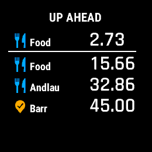
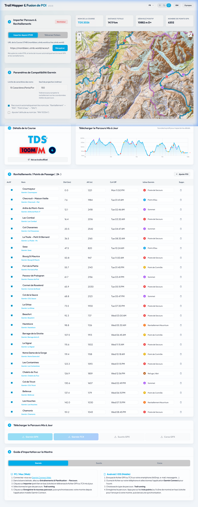

# 🏔️ UTMB Trail Mapper & Garmin GPX POI Merger

[](https://github.com/gnueole/eoleme-trail-mapper/actions)
[](LICENSE)

**Live Production Link**: [https://eole.me/trail-mapper/](https://eole.me/trail-mapper/)

Author: [Eole](https://eole.me) <[EMAIL_ADDRESS]>

Reach the finish line of your ultra with a map that guides you to every checkpoint.




A high-performance, responsive frontend utility designed for ultra-trail runners. It parses UTMB race tables (either fetched from UTMB URLs or pasted as raw text/HTML), visualizes GPX routes on an interactive Leaflet map, displays a custom-rendered elevation profile, and merges checkpoints/aid stations directly into the GPX track as Garmin-compliant **Course Points** (`<coursepoint>`).

This ensures your Garmin Fenix, Forerunner, or Enduro device displays exact distances, elevation data, and customized icons (like food/water/medical stations) directly inside your navigation screens.


---

## ✨ Features

* **🔗 UTMB Race Integration**:
  * Fetch course tables and GPX files directly from `montblanc.utmb.world` or `live.utmb.world` URLs.
  * Robust fallback parser for copy-pasted HTML tables or raw schedule text.
* **🗺️ Interactive Mapping & Visualization**:
  * Real-time route and aid station plotting on a Leaflet-powered map.
  * Custom canvas elevation profile chart with interactive cross-hair hover tracking.
* **⌚ Garmin Device Optimization**:
  * **Length Limits**: Truncate POI names to 10 characters (older Fenix/Forerunner models) or 15 characters (newer models) to prevent cutoffs.
  * **Shorten Abbreviations**: Automatically convert long French/English terms (e.g., *"Ravitaillement"* &rarr; `RAV`, *"Point d'eau"* &rarr; `EAU`, *"Secteur difficile"* &rarr; `DIFF`).
  * **Elevation Tagging**: Optionally append station altitudes directly into the POI name (e.g., `RAV 1025m`).
  * **Snapping Algorithm**: Automatically snaps checkpoint coordinates to the closest point along the GPX track within a configurable threshold (in meters).
* **🗂️ Standardized Garmin Icons**:
  * Map checkpoints to native Garmin waypoint types (Aid Station, Water, First Aid, Summit, etc.) for clean on-device symbol rendering.
* **⚡ Production Grade Architecture**:
  * FastAPI backend serving the Leaflet map frontend and secure in-memory GPX/TCX merging.
  * Containerized using Python, optimized for zero-disk operations and SSRF safe external downloads.

---

## 📂 Project Structure

```text
trail-mapper/
├── docker/
│   ├── Dockerfile                  # Production FastAPI container build
│   ├── docker-compose.yml          # Local dev compose (hot-reloads code)
│   └── docker-compose.prod.yml     # Production compose behind Traefik
├── public/                         # Web frontend (Leaflet maps, ES Modules)
│   ├── index.html                  # HTML5 markup structure
│   ├── styles.css                  # Premium dark/light styles
│   ├── app.js                      # Core JS orchestrator
│   ├── state.js                    # Global reactive state & persistence
│   ├── translations.js             # EN/FR text & symbol translations
│   ├── map-utils.js                # Leaflet map styling & snapping logic
│   ├── elevation-chart.js          # Canvas altimetric profile
│   └── utils.js                    # Garmin name cleanups & formatting
├── garmin_course_injector.py       # Core waypoint calibration engine + CLI utility
├── server.py                       # FastAPI backend server
├── requirements.txt                # Python backend package dependencies
├── Makefile                        # Dev env controls & VPS deployment commands
├── package.json                    # Project metadata & scripts
├── architecture.md                 # Design & component layout (see link below)
├── TODO.md                         # Active development roadmap (see link below)
└── README.md                       # Documentation (this file)
```

For more detailed technical components, check out the **[Architecture Overview](architecture.md)** and the **[Development Roadmap & TODOs](TODO.md)**.

---

## ⌚ CLI Usage (For Power Users)

For terminal speed and local scripting, you can run the core engine directly as a CLI tool without starting the web server.

```bash
# General help
python garmin_course_injector.py --help

# Run with defaults
python garmin_course_injector.py -i public/valdaran-cdh.gpx -d 110.4

# Download GPX and Google Sheets CSV directly
python garmin_course_injector.py \
  --input-url "https://example.com/route.gpx" \
  --stations-url "https://docs.google.com/spreadsheets/d/e/2PACX-.../pub?output=csv"
```

---

## 💻 Local Development

The development environment is containerized and runs on Port `3040`.

### Prerequisites
* [Docker Desktop](https://www.docker.com/products/docker-desktop/)
* [Doppler CLI](https://docs.doppler.com/docs/install-cli) (optional, for syncing environment secrets)

### Setup & Run
1. **Configure and sync secrets** (falls back to `.env.example` if Doppler isn't used):
   ```bash
   make configure
   ```
2. **Start the local Docker containers**:
   ```bash
   make dev
   ```
3. **Access the application**:
   Open [http://localhost:3040/trail-mapper/](http://localhost:3040/trail-mapper/) in your browser. Live reloading is supported via volume mounts mapping to the `public/` directory.

### Other Commands
* Stop containers: `make down`
* Restart environment: `make restart`

---

## 🚀 Production Deployment

Deployments are automated through a combination of **GitHub Actions** and the local **Makefile**.

1. **Automated Builds**:
   Pushing to the `main` branch triggers a GitHub Actions workflow that builds the Docker image and publishes it to the GitHub Container Registry (GHCR) as `ghcr.io/gnueole/eoleme-trail-mapper:latest`.

2. **VPS Deployment**:
   Trigger the pull-and-recreate sequence on the production VPS (`eole.me`):
   ```bash
   make deploy
   ```
   *Note: This downloads environment variables from Doppler (`config: prd`), updates the `docker-compose.prod.yml` configuration on the server, stops conflicting containers, pulls the latest image from GHCR, and starts the container behind Traefik.*

3. **Combined Push & Deploy**:
   To commit, push, wait for the GitHub build to complete, and automatically trigger the VPS redeployment:
   ```bash
   make deploy-delay
   ```

4. **Monitoring logs**:
   ```bash
   make checklogs
   ```

---

## 📄 License
This project is licensed under the MIT License - see the `LICENSE` file for details.
